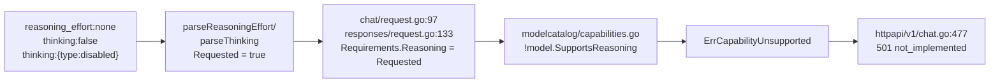

# 2026-08-21 第二轮全量审查、修复与部署

> 范围：全仓库 Go 后端 + Vue3 前端，承接 [`../代码全量调研与优化建议.md`](../代码全量调研与优化建议.md) 与 [`2026-08-20-性能优化调研与实施.md`](2026-08-20-性能优化调研与实施.md)。
> 文档定位：**二次使用底稿**——已修缺陷的完整证据链、未修待办的可直接接手清单、可复用脚本与方法论纪律。
> 所有"已验证"结论均来自真实执行输出；未验证项逐条标注。**本文不含任何凭据**，密码类一律记为 `[已脱敏]`。

## 一、本轮结果速览

| 项 | 结果 |
|---|---|
| 提交 | `404d4f9`（第一批）→ `26def3d`（第二批）→ `85ee67d`（探针脚本），均已推送 `main` |
| 部署 | 生产运行 `nvidia-router:deploy-20260821-review-3`，`Up (healthy)` |
| 回滚坐标 | `nvidia-router:deploy-20260821-review-2` @ `/opt/nvidia-router-releases/20260821-review-2` |
| 已修缺陷 | 10 项（3 + 7），每项回归测试均验证过"注掉修复→测试必须失败" |
| 未修待办 | 5 项（含 1 个 P1、3 个 P2），位置与修法已定位到行 |
| 未覆盖域 | 5 个（`httpapi`、`xkproxy`、`router`/`upstream`、`app`、前端 `web/`） |
| 本机验证 | `gofmt -l` 空、`go vet ./...` 干净、`go build ./...` 干净、`go test ./...` 全绿 |
| 未验证缺口 | `go test -race` 本机无法运行（无 cgo/gcc），由 CI 覆盖 |

## 二、已修缺陷完整清单

### 第一批（提交 `404d4f9`，发布 `20260821-review-2`）

#### 1. P1 — 推理"关断"被误判为能力需求，非推理模型整体 501

**位置**：`internal/compat/reasoning.go`、`internal/protocol/chat/request.go:97,144-145`、`internal/protocol/responses/request.go:133`

**失败链路**（逐行确认）：

解析层对 `none`/`off`/`disabled`/`false` 一律置 `Requested: true`（调用方确实提了这个参数），而两个协议都直接把 `Requested` 当作能力需求。**后果**：任何把 `reasoning_effort` 当全局默认发送的客户端，会丢掉全部非推理模型。

**修法（必须成对，否则症状平移）**：

| 半 | 改动 | 不做会怎样 |
|---|---|---|
| 能力判定 | 新增 `ReasoningSpec.RequiresReasoning() = Requested && Level != none` | — |
| 出站清理 | 新增 `compat.StripReasoning`，一次清掉 `reasoning_effort`/`reasoning`/`thinking` 三个互冗余别名 | `MarshalFor` 快路径把别名原样转发给 NIM，NIM 对 schema 外字段答 **422**（同理由见 `chat/request.go:186` 删 `max_completion_tokens`） |
| 快路径 | 条件收紧为 `!r.reasoning.Requested` | strip 被 raw 快路径绕过 |

**收窄范围是关键**：strip 只在"显式关断 **且** 模型不支持推理"时触发。不能扩到 `Requested` 全集——`internal/protocol/responses/request_test.go:236` 有带理据的既有测试，**故意**把推理请求转发给本地标记为非推理的模型交由上游裁决。

**回归测试**：`internal/protocol/chat/reasoning_off_test.go`（4 个）、`internal/protocol/responses/reasoning_off_test.go`（3 个）。四个半边均单独验证过可失败。

#### 2. P1 — 启动安全审计的监听地址判定失效

**位置**：`internal/app/app.go`（`listenExposure` + `checkProductionSecurity`）

`ListenAddress` 恒为 `host:port`，却被整体拿去和裸主机名比较 → 每个回环部署都误报三条 SECURITY 告警，而裸 `:port` 通配形式反而**跳过**公网绑定告警。

**连带发现（重要）**：修好后 `tests/mocknvidia` 的 `TestSecretsAndBodiesDoNotLeakIntoResponsesLogsOrSQLite` 稳定失败——告警文案含 `Cookie` 字样，而泄漏扫描是 `bytes.Contains(artifact, []byte("Cookie"))` **裸子串匹配**。

**根因不在测试**：测试 harness 手搭 `config.Config`，`ListenAddress` 为空；而 `config.Load` 永远补默认值（`config.go:137` + `valueOrDefault`），所以空地址只可能来自"自带 listener 的进程内 harness"，此时无 socket 可审计 → early return。**没有为了让测试过而削弱泄漏断言。**

**定位手法**：在 HEAD 建 `git worktree` 跑同一测试，确认是本轮引入而非既有失败。

**回归测试**：`internal/app/production_security_test.go`（5 个，含 `TestCheckProductionSecuritySilentWithoutListenAddress`）。

#### 3. P2 — gofmt 无 CI 门禁

golangci-lint 不带配置文件运行时，**v2 默认不启用 gofmt linter**，26 个文件已漂移，其中 3 个是真畸形（函数签名与首语句挤在一行）：`internal/crypto/rotation.go`、`internal/httpapi/v1/chat.go`、`internal/observability/stats.go`。

已在 `.github/workflows/ci.yml` 加 `gofmt -l .` 门禁。

### 第二批（提交 `26def3d`，发布 `20260821-review-3`）

| # | 级别 | 位置 | 失败场景 | 修法 | 回归测试 |
|---|---|---|---|---|---|
| 4 | P1 | `internal/modelcatalog/repository.go` `saveSelection` | `fmt.Errorf("...: %w", validateEnabledProvider(...))` 中该函数对两种受支持 provider **均返回 nil**，`%w` 包 nil 仍是**非 nil** error。已存储的 opencodefree 模型再以 `enabled=true` 保存必失败，且 `SaveSelectionsResult` 为单事务，同批次无关模型一并回滚 | 仅在确有错误时包装，保留守卫本体 | `TestSaveSelectionsReenablesStoredOpenCodeFreeModelWithBatchPeer` |
| 5 | P1 | `internal/nvidiakey/repository.go` `EarliestCooldownExpiry` | 缺 `cooldown_until > now` 过滤；`cooldown_until` 仅由 `markSuccess` 清除，探测持续失败的 Key 永久返回过去时间戳 → `nextDelay` 恒返回 0 → 扫描循环背靠背空转，每轮发真实 NVIDIA `/v1/models`，击穿免费配额 | SQL 加 `AND cooldown_until > ?`；钩子签名改为接收 checker 自身 `clock.Now()` | `TestEarliestCooldownExpiryIgnoresAlreadyExpiredCooldowns` |
| 6 | P2 | `internal/accesskey/service.go` + `cache.go` | 命中缓存但身份已过期时调 `invalidate()` 重建整个 map，单个持过期 Key 的客户端即可清空全实例认证缓存 | 新增 `cache.drop(digest)` 按 digest 删单条；`invalidate()` 保留给只有 key ID 的管理面变更 | `TestExpiredCachedKeyDropsOnlyItsOwnEntry` |
| 7 | P2 | `internal/sse/prime.go` | `context.AfterFunc` 闭包捕获 `response.Body` **字段**，该字段随后被 `replayReadCloser` 覆写；取消时序竞态下可能关错对象，泄漏上游连接不归还 transport 池 | 捕获局部变量 `upstreamBody` | 无（需 `-race`，本机不可用；静态确认） |
| 8 | P2 | `internal/protocol/responses/stream.go` `Convert` | `applyDelta` 出错时直接 `return`，不发终止事件；客户端已收到 `response.created` 却永远等不到 `response.completed`/`[DONE]`，挂到 idle 超时（生产 180s） | 对齐同 switch `default` 分支：先 `finalize(...true)` 再返回包装错误（`finalize` 有 `s.finalized` 幂等守卫） | `TestStreamApplyDeltaFailureStillEmitsTerminal` + `rejectingEmitter` |
| 9 | P3 | `internal/sse/proxy.go` | 写超时不支持时同时 `watchdog.Stop()`，与注释声明的"降级为仅 watchdog"相反，并使 `ErrWriteDeadlineUnsupported` 分支成为死代码 → 卡住的客户端无任何时间上限 | 删掉 `watchdog.Stop(); watchdog = nil`，只保留 `opts.WriteIdleTimeout = 0` | 无（生产 `ResponseWriter` 支持 `SetWriteDeadline`，可达性低） |
| 10 | P3 | `internal/protocol/chat/image.go` | `defer imageDecodePool.Put(bufPtr)` 在**语句处**求值，而 `bufPtr` 随后被换成扩容后的新 buffer → 大 buffer 永不归池，池对大图场景完全空转 | 改为 `defer func() { imageDecodePool.Put(bufPtr) }()` | 无（观测池复用需引入仅为测试存在的生产 seam，不值得） |

### 回归测试的失败证据（注掉修复后实测输出）

| 缺陷 | 观测到的失败信息 |
|---|---|
| #4 | `validate existing model provider "opencode-free/batch-probe": %!w(<nil>)` |
| #5 | `expired cooldown must not schedule a sweep, got 2026-07-30 02:59:00 +0000 UTC` |
| #6 | `survivor lost its cache entry: authenticate access key: invalid access key` |
| #8 | `Convert err = emit refused, want it to name the apply stage` |

## 三、两次主动撤回（方法论核心，优先阅读）

### 撤回一：把有效守卫误判为死代码

缺陷 #4 最初的修法是**整段删除** `previousProvider` 校验分支，理由是"`validateEnabledProvider` 对两种 provider 都返回 nil，分支恒不触发"。

跑全量测试后 `TestSaveSelectionRejectsEnablingExistingNonNVIDIAProvider` 失败。读该测试发现它 seed 的是 `provider='openai_compatible'`——**不属于**两种受支持 provider，`validateEnabledProvider` 对它**确实返回错误**。守卫真正的作用是：拦住"存储 provider 不受支持的历史行，被 `INSERT ... ON CONFLICT` 静默改写成 nvidia 并启用"。

> **教训**：判断一段校验是不是死代码，必须把它的**输入取值域**走一遍，而不是只看当前业务里常见的那两个值。既有测试就是取值域的现成证据。正确修法是把 `%w` 包装收进 `if err != nil`，两个测试同时通过——两个半边都被编码进测试。

### 撤回二：被数据否掉的性能假设

观测到 `stepfun-ai/step-3.7-flash` 即使收到 `thinking:{"type":"disabled"}` 仍返回 `reasoning_content`。先怀疑是 `compat/reasoning.go` 的 `availableLevels` 在 `ZeroAllowed=false` 时丢掉 `none`、被 `nearestLevel` 拉回 enabled。

**实测证伪**：线上该模型 `zero_allowed=true` 且 levels 含 `none`，路由器确实发了 disabled，是 NVIDIA 上游不理会 → 外部归因。

**对照组同时证明路由器侧正确**：`openai` 线格式的 `opencode-free/nemotron-3-ultra-free` 在 `none` 下 `completion_tokens` 39→2、`reasoning_chars=0`。

> **教训**：判定"关断是否生效"必须**跨线格式做对照**，不能只看单模型。先证伪再动手，省掉一次错误修改。

## 四、未修待办（可直接接手，按优先级）

| # | 级别 | 位置 | 失败场景 | 建议修法 |
|---|---|---|---|---|
| A | **P1** | `internal/protocol/responses/nonstream.go:177-203` `extractText`（触发点 `:111`→`:130`） | 上游 200 且 `content` 完整，但 `reasoning_content` 是对象形态（如 `{"thought":..,"text":..}`）→ 只接受字符串/`[{type,text}]` → 报错 → `httpapi/v1/responses.go:155` 包成 `fault.Protocol` → 客户端 **502**，已生成答案被丢弃，且 `fault.Protocol` 触发换 Key 重试白烧一次上游调用。**同形态在 `upstream/nvidia/chat.go:287-317`（`hasTextValue`）与流式 `delta.go:107-138` 都被接受 → 同模型同形态，流式 200 / 非流式 502** | `content` 保持严格；reasoning 三别名走宽松解码，复用 `delta.go:107-138` 的容忍集，全不匹配时 `present=false` 丢弃 reasoning 而非整体失败。同函数 `:118` 的"reasoning aliases disagree"改为按 `reasoning_content > reasoning > thinking` 取首个非空 |
| B | P2 | `internal/protocol/responses/stream.go:185-204` | 首个 tool delta 只带 `name`、`id` 在后续 chunk 才到时，`:204` 只对 `name` 做迟到补正，`id` 无对应分支 → `output_item.added`/`arguments.delta`/`arguments.done`/`output_item.done` 与 `state.go:190` 全程空 `call_id`，客户端无法回提交工具结果，整个 tool-use 回合断掉 | 补对称的 `if call.ID != "" && tool.id == ""`；终态读 `tool.id` 处加与 `nonstream.go:141-143` 一致的 `call_%d` 兜底。注意 `added` 可能已带空 id 发出，建议把 `added` 延后到首个带 id 的 chunk |
| C | P2 | `internal/modelhealth/service.go:355-374,384-390` + `model.go:115-117` | 429 风暴把所有 Key 打入冷却 → `selectNVIDIAKey` 用 `FirstEnabledID`（SQL 排除冷却中的 Key）→ `sql.ErrNoRows` → `errorCode="no_credential"`、`outcome=skipped` → `ClassifyStatus` 返回 `StatusUnconfigured`。渠道状态页把每个 NVIDIA 模型显示为"未配置/无凭据"，把运维指向"你没配 Key"，真实原因是"Key 全在冷却"，**两种状态处置动作完全不同** | `selectNVIDIAKey` 区分"一把 Key 都没有"与"有 Key 但全在冷却"，`probeOne` 写 `keys_cooling`，前端文案分开 |
| D | P2 | `internal/protocol/chat/request.go:144-155` | 重复顶层键（如两个 `temperature`）在 raw 快路径被原样转发上游，NIM 严格 schema 可能 422；慢路径 `marshalFields` 从 map 重建天然去重。**"校验看到的字节"与"转发的字节"不是同一份**，与已修的"快路径丢消息归一化"同类 | `Parse` 阶段检测顶层重复键置 `rawUnsafe`，快路径条件加 `&& !r.rawUnsafe`。复用 `image.go` 已有的 `jsonScanner`，不需要新抽象。**未验证** NIM 对重复顶层键的实际反应 |
| E | P3 | `internal/compat/reasoning.go:412-421` + `ResolveReasoning:171-176` | 拼错的 `reasoning_effort:"hgih"` 在 `!DynamicAllowed` 时按 `budgetForLevel==0` 算最近邻 → `none`。用户以为开了最高强度思考，实际**把思考关掉**，全程无告警 | 在 `ResolveReasoning` 处理（parse 层拿不到 profile）：未知 level 且 `!DynamicAllowed` 时返回 `invalid_parameter` 并列出该模型接受的取值 |

### 其他登记项（未定级/需决策）

- `internal/modelcatalog/service.go:604-622`：OpenCodeFree 同步**只降不升**——网关返回部分列表时缺失项被永久停用，无自动恢复路径。整体空列表不会误伤（`client.go:269-271` 对空列表返回 `ErrProtocol`）。"部分列表"前提**未在真实网关验证**。
- `internal/modelhealth/repository.go:348-350`：`formatTimestamp` 用 `RFC3339Nano`（**变长**，去尾随零），SQL 里直接做 `>=`/`<`/`ORDER BY` 字典序比较。小数位构成前缀关系时序反转（`.5Z` > `.50001Z`）。同秒+前缀概率极低故 P3。**注意与 `nvidiakey.formatTimestamp`（`Truncate(second)+RFC3339`，定长，字典序安全）区分，两处不要混用同一套比较假设。**
- `internal/protocol/responses/config.go:51` 无条件 `response["error"] = nil`：`response.failed` 终态也带 `"error":null`，客户端拿不到失败原因。邻近的 `incomplete_details = nil` 有契约测试 `nonstream_contract_test.go:39-41` 背书，按对称性 `error = nil` 可能是同一套"显式 null 字段"契约。**需决策**是"契约缺一块覆盖"还是"有意不透传上游错误细节"。
- `internal/protocol/responses/request.go:314-319` 拒绝空字符串 content，注释称"chat 路径也这么做"，但 `chat/image.go:514-526` 实际**放行**。注释误述确定；行为是否统一需决策。
- `internal/compat/reasoning.go:202` `preserveNativeThinking` 在 `wireFormat=="openai"` 时仍发 `thinking` 对象（schema 外字段，严格上游可能 422）——已知有意契约，仅登记。

### 未覆盖域（本轮完全没审）

`internal/httpapi/`、`internal/xkproxy/`、`internal/router/` + `internal/upstream/`、`internal/app/`、前端 `web/src/`。

## 五、部署与验证记录

### 部署链路

`scripts/deploy/deploy_remote.py <tag>` 一条命令完成：打包 → 上传 → 继承 `.env`/`docker-compose.deploy.yml` → 构建 → 停 app → **旧镜像**备份 → 新镜像启动 → 健康校验，失败即停并打印回滚坐标。

固定结构：release 目录 `/opt/nvidia-router-releases/<tag>`、镜像 `nvidia-router:deploy-<tag>`、compose `docker-compose.yml + docker-compose.deploy.yml`、数据卷 `nvr-data`（external）。**国内构建必须带 `--build-arg GOPROXY=https://goproxy.cn,direct`**。

### admin 密码重设

新增 `scripts/deploy/reset_admin_password_remote.py`，脚本内**无任何凭据**：自身从 stdin 读密码 → 停 app（释放进程锁）→ `docker run --rm -i` 把密码**只写进容器 stdin** → 起 app → 登录 200 + 匿名 `/metrics` 401 双验证。密码不进 argv、文件、环境变量、日志或远端进程表。

关键前提（已确认）：
- `admin reset-password` 只读**一行** stdin，无二次确认（`internal/app/cli.go:64-69,93-106`）。
- `openExistingRouterDatabase` 仅做 `database.Open`，**不需要主密钥/env-file**（与 `db backup` 同）。
- DB 已存在 admin 行时 `NVIDIA_ROUTER_INITIAL_ADMIN_PASSWORD` 无效，必须走 CLI。
- `ResetPassword` 置 `must_change_password=0` 并吊销全部会话，改完可直接登录。

### 验证结果（真实输出）

| 检查 | 结果 |
|---|---|
| `gofmt -l .` | 空 |
| `go vet ./...` / `go build ./...` / `go test ./...` | 全部干净/全绿 |
| `go test -race` | **无法运行**：本机 `CGO_ENABLED=0` 且 PATH 无 gcc。由 CI 覆盖（`-race ./...` + `./tests/mocknvidia -count=10`） |
| `scripts/check-secrets.sh` | `No NVIDIA or access key secrets found in Docker build context.` |
| 部署产物校验 | grep release 目录源码确认 `RequiresReasoning`/`StripReasoning`/双协议接线/`app.go` 空地址早返/`ci.yml` gofmt 门禁/迁移至 038 齐全 |
| 线上推理矩阵（review-2） | 12/12 全 200（2 线格式 × 6 形态） |
| 线上健康（review-3） | `/health/live`、`/health/ready` 均 ok，容器 `Up (healthy)` |
| 线上管理门禁 | 匿名 `/metrics` 401、带会话 200、登录 200 |
| 出口池 + NVIDIA 渠道（review-3 预热后） | `proxy_pool_healthy=23`，NVIDIA 连续 **5/5 全 200** |

### 部署后误判 502 的陷阱（新增沉淀）

容器重启会把 XApi 出口池**清空重建**，采集+验证完成前 NVIDIA 渠道返回 502 `upstream_proxy_unavailable`。本轮 review-3 首轮探测即命中：NVIDIA 侧几乎全 502，而 **OpenCodeFree 渠道不经出口池，同一时刻全 200——天然对照组**。

> **纪律**：部署后验证必须**先读 `/metrics` 的 `proxy_pool_healthy` 再判定渠道故障**，否则会把预热期误报成回归。脚本 `scripts/test/pool_warmup_check_remote.py`（读池 gauge + 间隔重试 5 次）。

## 六、可复用脚本

| 脚本 | 用途 | 密码传递 |
|---|---|---|
| `scripts/deploy/deploy_remote.py <tag>` | 全流程部署 + 备份 + 健康校验 + 回滚坐标 | 不涉及 |
| `scripts/deploy/reset_admin_password_remote.py` | 重设 admin 密码并双向验证 | 自身 stdin → 容器 stdin |
| `scripts/test/remote_exec.py <prog> --stdin-env <ENV>` | 把本地探针 base64 送到远端 `python3` 执行 | 环境变量 → 远端 stdin |
| `scripts/test/reasoning_off_probe_remote.py` | 推理 6 形态 × 2 线格式矩阵 | stdin |
| `scripts/test/reasoning_profile_dump_remote.py` | 导出启用模型完整 reasoning profile（`zero_allowed`/`levels`/预算） | stdin |
| `scripts/test/pool_warmup_check_remote.py` | 读出口池 gauge + 间隔重试，区分预热与回归 | stdin |
| `scripts/test/post_deploy_verify_remote.py` | 上一轮的上线后最小验证集 | stdin |

**在机联调固定约束**：管理 API 变更请求（POST/PATCH/DELETE）必须带 `Origin: http://127.0.0.1:3756`，否则 403 `invalid_origin`；`proxy-pool`/`models` 响应都在 `data` 键下；monitoring `range` 仅 `24h/7d/30d`。

## 七、线上现状（判定缺陷可达性的前提）

11 个模型，8 个启用且**全部 `supports_reasoning=true`**；三个非推理模型（`meta/llama-3.2-90b-vision-instruct`、`openai/gpt-oss-120b`、`opencodefree/x-preview-f-free`）**均停用**。

> **因此"非推理模型 + 推理关断 → 501"这类缺陷在线上不可复现**——停用模型在能力门禁之前就被拒。该修复的线上证据只能是"单测 + 部署产物含修复"，要真复现必须临时启用一个非推理模型（**改生产配置、会让该模型对客户端可路由，本轮未做**）。

启用模型的 reasoning profile（实测导出）：NVIDIA 侧四个均为 `thinking` 线格式、`zero_allowed=true`、`max_budget=128000`、`dynamic_allowed=true`；OpenCodeFree 侧三个为 `openai` 线格式、`zero_allowed=true`。

## 八、子代理编排经验

| 现象 | 根因 | 有效做法 |
|---|---|---|
| 第一轮 7 个审查子代理中 6 个催报无响应 | 把"汇报"设计成了 **SendMessage 旁路信道** | 让子代理的**最终返回文本就是报告全文**（Agent 工具返回值），prompt 固定 `## 结论/覆盖范围/发现/未覆盖` 段式、限最多 5 条、强制 `file:line` + 具体失败场景 |
| 第二轮 6 个审查 + 3 个修复子代理集体失败 | API 配额耗尽（`403 pre-consume quota failed`） | **失败后第一件事是 `git status` 确认没留下半成品编辑**（本次工作树干净），随后自己接手 |
| 子代理报"缺陷"与既有测试冲突 | 多数是有意设计 | 一律标 `存疑` 并说明冲突，不单方面推翻；本轮据此撤回 1 次错误修法（见第三节） |

## 九、待决风险

**明文 HTTP 暴露（本轮三次重申，未消除）**：路由器发布在 `0.0.0.0:3756`，`ADMIN_SECURE_COOKIE=false`、`ADMIN_EXTERNAL_ORIGIN` 空、`TRUSTED_PROXY_CIDRS` 空、`ufw` inactive——启动日志四条 SECURITY 告警可见，`hangzhou2-2/部署说明.md` 已记为既有限制。

**影响**：admin 密码（本轮刚重设，值 `[已脱敏]`）与 AccessKey 均以明文经公网传输。

**建议**：前置 HTTPS 网关（nginx/Caddy）后，把 `NVIDIA_ROUTER_ADMIN_SECURE_COOKIE=true`、`NVIDIA_ROUTER_ADMIN_EXTERNAL_ORIGIN`、`NVIDIA_ROUTER_TRUSTED_PROXY_CIDRS` 一并配上，或改为仅绑回环。
