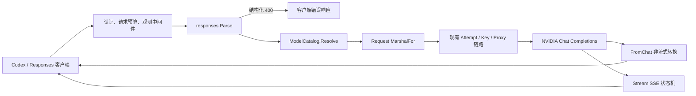

# Responses 核心兼容优化设计

- 日期：2026-08-16
- 状态：待用户审查
- 适用接口：`POST /v1/responses`
- 兼容目标：Codex 与遵循 OpenAI Responses 核心契约的无状态文本、函数工具客户端
- 上游约束：NVIDIA Chat Completions，不具备 OpenAI 服务端状态和托管工具能力

## 1. 决策摘要

本轮采用“Responses 核心兼容层”，不实现完整 OpenAI Responses 服务：

1. 以 OpenAI Responses 扁平函数工具格式为标准输入，并继续接受现有 Chat 嵌套格式作为兼容扩展。
2. 将当前“读取部分字段并静默丢弃其余字段”改为明确的三类策略：转换、已记录的兼容 no-op、结构化拒绝。
3. 请求解析改为与现有 Chat 协议一致的 `Parse -> Resolve -> MarshalFor` 流程，避免 handler 与转换器重复解析并产生不同错误顺序。
4. 保证本服务生成的核心 output item 可以作为下一轮 input item 回输，覆盖函数调用闭环。
5. 修正非流式 Response 对象和 SSE 事件的字段形状，使流式与非流式表达同一语义。
6. 保留当前 Access Key、模型白名单、Key 调度、代理池、超时和重试链路，不建立第二套执行路径。
7. 不新增数据库迁移、生产依赖、API 版本、配置开关或只有一个实现的接口层。

## 2. 背景与已确认根因

当前 `internal/protocol/responses/request.go:266` 的 `mapTools` 只读取：

```json
{
  "type": "function",
  "function": {
    "name": "lookup"
  }
}
```

OpenAI Responses 的标准函数工具是扁平结构：

```json
{
  "type": "function",
  "name": "lookup",
  "description": "Look up a value",
  "parameters": {
    "type": "object"
  },
  "strict": true
}
```

标准请求中不存在 `tools[i].function`，因此当前代码在
`internal/protocol/responses/request.go:292` 返回：

```text
missing_required_parameter
A function tool requires a function definition.
```

该错误在 `internal/httpapi/v1/responses.go:65` 的请求转换阶段产生，早于
`Attempt.Run` 和 NVIDIA 上游调用，因此与模型可用性、XApi、代理池和 Key
调度无关。

现有测试 `internal/protocol/responses/request_test.go:135` 只使用 Chat 嵌套工具，
所以相关包测试通过仍无法覆盖标准 Responses 请求。

## 3. 目标与非目标

### 3.1 功能目标

1. Codex 携带标准函数工具目录调用 `/v1/responses` 时不再因工具形状被本地拒绝。
2. 文本请求、单对象消息、消息数组、函数调用和函数输出可以稳定转换到 NVIDIA Chat。
3. 标准扁平工具和现有嵌套工具均可用，转换后的上游结构始终是合法 Chat 工具。
4. 支持 `tool_choice` 和 `parallel_tool_calls` 的核心语义。
5. 支持 `developer`、`system`、`user`、`assistant` 的核心消息角色。
6. 本服务输出的 `message`、`function_call`、`function_call_output` 和
   `reasoning` 核心 item 可以被下一轮解析，不出现“第一轮成功、第二轮失败”。
7. 非流式和流式响应具备一致的 item、状态、ID、usage 和完成原因。
8. 无法承载的功能返回带精确 `param` 的结构化错误，不静默改变请求语义。

### 3.2 兼容性目标

“核心兼容”表示：

- 客户端使用当前官方 Responses 文本与函数调用主路径时可以完成多轮工具闭环。
- 请求与响应结构可以被常规 OpenAI-compatible 客户端按 Responses 语义解析。
- NVIDIA Chat 无法承载的能力有稳定、可发现、可测试的拒绝行为。

它不表示实现官方文档列出的所有 Responses 字段、工具类型和资源端点。

### 3.3 非目标

本轮不实现：

- `previous_response_id`、`conversation` 或其他服务端会话状态。
- `store: true`、后台响应、响应查询、取消、删除或输入项列表资源。
- Web Search、File Search、Computer Use、MCP、Connector、Shell、Custom Tool
  等 OpenAI 托管或外部执行工具。
- Prompt 模板、Prompt Cache、Context Management、Service Tier 调度。
- Responses 图片、音频或文件输入。
- OpenAI reasoning encrypted content 的生成、解密或状态续接。
- 为兼容功能新增数据库表、管理页面或运行时开关。
- 修改 `/v1/chat/completions` 的现有公共契约。

## 4. 设计原则

1. **官方形状优先**：标准 Responses 形状是规范入口，旧 Chat 形状仅为兼容扩展。
2. **边界处规范化**：进入路由器后立即转成单一内部表示，后续代码不再判断多种外部形状。
3. **不静默降级**：影响生成、状态或安全语义的字段不能无提示丢弃。
4. **中性值可接受**：`null`、`false`、默认枚举等不要求额外能力的值可以按明确规则视为未提供。
5. **输出可回输**：路由器输出的核心 item 必须能被同一路由器再次接受。
6. **流式与非流式同义**：两条输出路径共享字段约束，不允许结构随 `stream` 改变。
7. **现有链路复用**：模型解析、Key 选择、代理、超时、重试、观测和安全错误继续走现有实现。

## 5. 总体架构



### 5.1 内部请求对象

在现有 `internal/protocol/responses` 包内引入与 Chat 协议相同的内部模式：

```go
type Request struct {
    // private normalized state
}

func Parse(body []byte) (Request, error)
func (r Request) PublicModelID() string
func (r Request) Stream() bool
func (r Request) MarshalFor(model modelcatalog.Model) ([]byte, error)
func (r Request) ResponseConfig() ResponseConfig
```

`Request` 不导出用户正文、工具参数或原始字段 map。`ResponseConfig` 只保存构造
Response 对象所需的非敏感协议配置，例如 `instructions`、`parallel_tool_calls`、
`tool_choice`、标准化工具定义、采样参数和输出格式。

handler 流程调整为：

1. 读取有预算的请求体。
2. `responses.Parse` 完成结构校验和规范化。
3. 使用 `Request.PublicModelID()` 解析已启用模型。
4. 使用 `Request.MarshalFor(model)` 构造 NVIDIA Chat 请求。
5. 将 `Request.ResponseConfig()` 同时传给非流式或流式输出转换。

现有 `parseResponsesHeader` 删除，避免同一请求被两套逻辑解析。模型解析发生在完整
请求结构校验之后；格式错误不得进入 ModelCatalog、Attempt 或上游。

### 5.2 ResponseConfig

`ResponseConfig` 为值对象，至少包含：

- 原始 `instructions` 或 `null`。
- 标准 Responses 扁平工具数组。
- 标准 Responses `tool_choice`。
- `parallel_tool_calls` 的规范化布尔值。
- `temperature`、`top_p` 和 `max_output_tokens` 的可空值。
- `reasoning` 与 `text` 的已接受配置。

它不包含 `input`、函数输出、NVIDIA Key、Access Key、代理信息或完整原始请求，
不得进入日志或数据库。

## 6. 顶层字段契约

每个字段必须归入下列三类之一。

### 6.1 转换并生效

| Responses 字段 | Chat 映射 |
|---|---|
| `model` | 由 ModelCatalog 映射为上游模型 ID |
| `input` | 转换为 `messages` |
| `instructions` | 转换为最前面的 `system` 消息 |
| `stream` | 转发为 Chat `stream` |
| `tools` | 标准化后转换为 Chat 嵌套函数工具 |
| `tool_choice` | 标准化后转换为 Chat 选择格式 |
| `parallel_tool_calls` | 转发同名布尔字段；缺省或 `null` 规范化为 `true` |
| `max_output_tokens` | 转换为 `max_tokens` |
| `reasoning.effort` | 转换为 `reasoning_effort` |
| `text.format` | 转换为 `response_format` |
| `temperature`、`top_p` | 转发同名字段 |
| `user` | 转发为 Chat `user`，不记录值 |

为保持现有调用方行为，继续接受以下 Chat 风格扩展：

- `reasoning_effort`
- `thinking`
- `seed`
- `stop`
- `presence_penalty`
- `frequency_penalty`

这些扩展不属于本项目宣称的标准 Responses 核心字段，但不得因本轮改造被删除。

### 6.2 明确兼容 no-op

下列值可以接受，但不会发送给 NVIDIA Chat；行为必须写入兼容文档：

| 字段和值 | 行为 |
|---|---|
| 任意可选字段的 `null` | 视为未提供，除非该字段本身是必填项 |
| `store: false` | 接受；路由器不持久化响应 |
| `background: false` | 接受；同步执行 |
| `text.verbosity: low/medium/high` | 接受但不强制；NVIDIA Chat 没有等价参数 |
| `reasoning.summary` | 接受为最佳努力提示；是否产生 summary 取决于上游 `reasoning_content` |
| `stream_options.include_obfuscation: false` | 接受；路由器不生成 obfuscation 字段 |
| `service_tier: auto` | 接受；继续使用当前 NVIDIA 调度 |
| `truncation: disabled` | 接受；继续使用现有请求预算和模型上下文限制 |
| 输入中的 `reasoning` item | 接受并忽略其内容，保证本服务输出可回输；不伪造 Chat reasoning 状态 |
| 消息的 `id`、`status`、`phase` | 接受并忽略，不改变消息正文和角色 |

no-op 字段只允许固定枚举和中性值。代码不得以通用“忽略未知字段”实现该策略。

### 6.3 明确拒绝

以下字段只要提供非 `null`、非中性值就返回 HTTP 400，错误码为
`unsupported_responses_feature`，并携带精确 `param`：

- `store: true`
- `background: true`
- `previous_response_id`
- `conversation`
- `metadata`
- `prompt`
- `prompt_cache_key`
- `prompt_cache_options`
- `prompt_cache_retention`
- `context_management`
- `include`
- `max_tool_calls`
- `moderation`
- `safety_identifier`
- 非 `auto` 的 `service_tier`
- `truncation: auto`
- `top_logprobs`
- `stream_options.include_obfuscation: true`
- 所有未列入本设计的未知顶层字段

拒绝未知字段是一项有意的行为变化：当前实现可能静默丢弃它们。新行为优先保证调用方
能够发现语义未生效，而不是返回表面成功。

## 7. 函数工具规范化

### 7.1 标准 Responses 工具

标准输入：

```json
{
  "type": "function",
  "name": "get_weather",
  "description": "Get weather",
  "parameters": {
    "type": "object",
    "properties": {
      "city": {"type": "string"}
    },
    "required": ["city"],
    "additionalProperties": false
  },
  "strict": true
}
```

上游 Chat 输出：

```json
{
  "type": "function",
  "function": {
    "name": "get_weather",
    "description": "Get weather",
    "parameters": {
      "type": "object",
      "properties": {
        "city": {"type": "string"}
      },
      "required": ["city"],
      "additionalProperties": false
    },
    "strict": true
  }
}
```

### 7.2 旧嵌套格式

现有 `{"type":"function","function":{...}}` 继续接受，并规范化到同一个内部
函数定义。响应中的 `tools` 始终使用标准 Responses 扁平格式，不回显旧嵌套形状。

当同一个工具同时出现扁平字段和 `function` 对象时，返回
`invalid_parameter`，不得猜测优先级。

### 7.3 字段校验

核心函数工具只支持：

- `type: "function"`
- 非空字符串 `name`
- 可选字符串或 `null` 的 `description`
- 可选 JSON object 或 `null` 的 `parameters`
- 可选 boolean 或 `null` 的 `strict`

下列高级字段会改变调用约束，但 Chat 上游没有可靠等价物，因此非空时明确拒绝：

- `allowed_callers`
- `defer_loading`
- `output_schema`

非函数工具，包括 Built-in、MCP、Custom、Shell、Web Search 和 File Search，返回
`unsupported_responses_feature`。工具名称、描述和 schema 不写入日志。

### 7.4 tool_choice

支持：

- `"none"`
- `"auto"`
- `"required"`
- 标准 Responses 具名函数：`{"type":"function","name":"get_weather"}`
- 现有 Chat 兼容格式：
  `{"type":"function","function":{"name":"get_weather"}}`

具名选择必须引用当前 `tools` 中存在的函数。Allowed Tools、Built-in、Custom 和其他
choice 类型明确拒绝。`required` 和具名函数选择要求标准化后的工具数组非空；
`auto` 配合空工具数组时不向 Chat 发送 `tool_choice`，避免上游拒绝无意义的工具控制。

## 8. Input item 规范化

### 8.1 接受的 input 外形

`input` 支持：

1. 非空字符串。
2. 单个消息对象。
3. 非空 item 数组。

字符串转换为一条 `user` 消息。单个对象先规范化为单元素数组，后续只维护一条 item
转换链路。

`input` 可以省略或为 `null`，但仅限非空 `instructions` 能够产生一条 system 消息时。
规范化完成后如果 `input` 和 `instructions` 都没有产生消息，返回
`missing_required_parameter`；不得向 Chat 上游发送空 `messages`。

### 8.2 消息角色和内容

支持角色：

- `developer`
- `system`
- `user`
- `assistant`

支持内容：

- 非空字符串。
- `input_text`、`text`、`output_text` 文本 part 数组。

`developer` 原样映射到 Chat `developer`。`instructions` 保持现有行为，映射为最前面的
`system` 消息，不改变既有调用方指令优先级。

图片、文件、音频和未知 content part 明确拒绝。空用户、developer 或 system 内容继续
拒绝；assistant 空内容仅在同时携带函数调用时允许。

### 8.3 函数调用闭环

支持：

- `function_call` -> assistant `tool_calls`
- `function_call_output` -> Chat `tool` 消息

`function_call` 要求非空 `call_id` 和 `name`，空 `arguments` 规范化为 `{}`。

`function_call_output.output` 支持字符串或纯文本 part 数组。对象、图片和文件输出不做
JSON 字符串化伪兼容，而是明确拒绝，避免工具结果语义改变。

### 8.4 reasoning 回输

NVIDIA Chat 无法消费 OpenAI encrypted reasoning state。本服务输出的 reasoning item
在下一轮输入时按已记录的 no-op 接受：

- 不把 reasoning 文本拼入用户或 assistant 正文。
- 不转发 `encrypted_content`。
- 不记录 summary 或 encrypted content。
- 其余 message、function_call 和 function_call_output 继续按顺序转换。

这是有意的有损兼容边界。若删除 reasoning item 后没有任何可转换输入，返回
`missing_required_parameter`，不发送空请求。

## 9. Chat 请求构造

规范化完成后只生成一种 Chat 请求形状：

1. `model` 使用已解析模型的 `UpstreamID`。
2. `messages` 按 Responses 输入顺序生成；`instructions` 位于最前。
3. `tools` 始终为 Chat 嵌套函数格式。
4. `tool_choice` 始终为 Chat 字符串或嵌套具名函数格式。
5. `parallel_tool_calls` 在工具数组非空时发送明确布尔值；无工具时仅保留在
   `ResponseConfig` 中，不向 Chat 发送无意义字段。
6. 流式请求由路由器合并 `stream_options.include_usage=true`，以便终态事件携带 usage。
7. Responses 的 `include_obfuscation` 不进入 Chat `stream_options`。
8. 未在兼容矩阵中列出的字段不得出现在上游 JSON。

`MarshalFor` 继续检查解析时的公共模型 ID 与已解析模型一致，并只在此处替换模型 ID。

## 10. 非流式 Response 契约

非流式成功响应至少包含官方 Response 核心字段：

- `id`
- `object: "response"`
- `created_at`
- `status`
- `error`
- `incomplete_details`
- `instructions`
- `metadata`
- `model`
- `output`
- `parallel_tool_calls`
- `temperature`
- `tool_choice`
- `tools`
- `top_p`
- `usage`（上游提供时）

继续保留现有 `output_text` 便利字段，作为向后兼容扩展。

### 10.1 message item

message item 包含：

- 稳定 `id`
- `type: "message"`
- `status: "completed"`
- `role: "assistant"`
- `content`

`output_text` part 包含 `type`、`text`、空 `annotations` 和空 `logprobs`，避免严格客户端
因缺失核心数组字段无法解码。

### 10.2 function_call item

function call 包含：

- `id`
- `call_id`
- `type: "function_call"`
- `status: "completed"`
- `name`
- `arguments`

NVIDIA Chat 只提供一个工具调用 ID，因此本轮继续将其同时用作 `id` 和 `call_id`。

### 10.3 reasoning item

当上游提供 `reasoning_content` 时，输出：

- 稳定 `id`
- `type: "reasoning"`
- `status: "completed"`
- `summary` 数组

该 summary 是 NVIDIA 可见 reasoning content 的最佳努力映射，不宣称等同于 OpenAI
encrypted reasoning。原始 reasoning 不写日志或数据库。

### 10.4 完成状态

| Chat `finish_reason` | Responses 状态 | incomplete reason |
|---|---|---|
| `stop`、`tool_calls`、空值 | `completed` | `null` |
| `length` | `incomplete` | `max_output_tokens` |
| `content_filter` | `incomplete` | `content_filter` |
| 上游协议或已提交流中断 | `failed` | 不伪装为 completed |

## 11. 流式事件契约

### 11.1 生命周期

流式事件保持以下顺序约束：

1. `response.created`
2. `response.in_progress`
3. 零个或多个 output item/content/delta 事件
4. 每个已打开 item 对应一个 done 事件
5. 恰好一个 `response.completed`、`response.incomplete` 或 `response.failed`
6. 兼容性 `data: [DONE]` 标记

继续保留 `[DONE]`，因为现有客户端和测试依赖该终止标记；标准终态仍由
`response.completed|incomplete|failed` 表达。每个 JSON 事件都包含与 SSE event 名一致的
`type`，`sequence_number` 保持当前从 0 单调递增的行为。

### 11.2 事件字段修正

必须修正：

- `response.reasoning_summary_text.delta.delta` 为字符串，不是 `{type,text}` 对象。
- reasoning summary 事件使用 `summary_index`，不使用 `content_index`。
- `response.function_call_arguments.done` 包含 `name`。
- output item added 使用 `status: "in_progress"` 和合法的初始空字段。
- output item done 使用 `status: "completed"` 和完整 item。
- message content part 包含合法的初始/完成文本字段及空 annotations/logprobs。
- 生命周期事件内嵌的 `response` 使用与非流式相同的核心字段和 `ResponseConfig`。
- terminal response 的 `output` 与此前 done item 完全一致。

### 11.3 资源与重试

保持现有语义：

- 第一个下游事件提交响应，提交后不得换 Key 或重放。
- 客户端取消同时关闭上游 Body。
- 写超时和慢消费者 watchdog 保持生效。
- 上游 `[DONE]` 才表示正常完成；提前 EOF 产生 `response.failed`。
- 当前工作树中 `markResponseComplete(response)` 的资源生命周期修复必须保留并整合，
  不得在实现本设计时覆盖。

## 12. 错误契约

### 12.1 本地请求错误

继续使用现有 OpenAI-compatible envelope：

```json
{
  "error": {
    "message": "...",
    "type": "invalid_request_error",
    "param": "tools[0].name",
    "code": "invalid_parameter"
  }
}
```

错误码分工：

| code | 用途 |
|---|---|
| `missing_required_parameter` | 必填字段不存在 |
| `invalid_parameter` | 类型、值、歧义或引用关系错误 |
| `unsupported_responses_feature` | 合法 Responses 能力超出本项目范围 |
| `invalid_json` | 请求体不是合法 JSON object |
| `request_too_large` | 超过现有 32 MiB 限制 |

所有本地 4xx 在模型调用和代理获取前返回，并保持 `retryable=false` 语义。

### 12.2 上游错误

上游非 2xx 继续进入现有 Attempt/Fault 规则：

- 请求级 4xx 不跨 Key 重试。
- 认证、限流、5xx 和代理错误保持现有归因。
- 不把 Responses 转换错误归因到 NVIDIA Key。
- 公开响应和日志不得包含 Key、代理凭据、请求正文、工具 schema 或函数输出。

### 12.3 请求关联

继续复用现有 observability middleware 生成的 `X-Request-ID` 和请求日志，不新增第二套
request ID。兼容性诊断只记录 endpoint、模型、状态、错误码和安全枚举，不记录工具定义
或消息内容。

## 13. 代码影响范围

### 13.1 修改

- `internal/protocol/responses/request.go`
- `internal/protocol/responses/types.go`
- `internal/protocol/responses/validate.go`
- `internal/protocol/responses/nonstream.go`
- `internal/protocol/responses/state.go`
- `internal/protocol/responses/stream.go`
- 上述文件对应的 `_test.go`
- `internal/httpapi/v1/responses.go`
- `internal/httpapi/v1/responses_test.go`
- `internal/httpapi/v1/responses_contract_test.go`
- `docs/API兼容范围.md`
- `docs/NVIDIA真实联调说明.md`

### 13.2 明确不修改

- 数据库 schema 和 migrations。
- Access Key 与管理员认证。
- ModelCatalog 数据结构和模型能力字段。
- Key Pool、Attempt 重试和冷却规则。
- 内置星空代理池、XApi 和网络 Transport。
- `/v1/chat/completions` 的解析和公共行为。
- Vue 管理页面。
- Docker/Compose 配置。

### 13.3 工作树整合约束

当前工作树已有其他未提交改动，且 `internal/httpapi/v1/responses.go` 包含响应 Body 完成
标记修复。实现者必须基于当前内容做局部修改，不得用旧版本覆盖、回退或重写用户改动。

## 14. 实施分段

### 14.1 第一段：请求规范化

- 先添加标准扁平工具失败测试。
- 建立 `Request` 和字段策略。
- 支持工具、tool_choice、parallel tool calls、developer 角色和可空字段。
- 保持旧嵌套工具兼容。
- 验证格式错误不会调用 Provider。

### 14.2 第二段：输出契约

- 引入 `ResponseConfig`。
- 补齐非流式 Response 核心字段和 item 状态。
- 修正 SSE reasoning、function arguments 和 item 生命周期字段。
- 添加流式/非流式同义 contract tests。

### 14.3 第三段：闭环与文档

- 添加完整函数调用两轮闭环测试。
- 添加路由器 output 重新作为 input 的回输测试。
- 更新 API 兼容范围和真实联调说明。
- 完成本地全量验证后，才进入 `hangzhou2-2` 真实联调。

三段属于同一个发布单元；任一段未通过时不得部署半成品。

## 15. 测试设计

所有实现按 TDD 进行：先看到目标测试在现有代码上因正确原因失败，再写最小实现。

### 15.1 请求单元测试

表驱动覆盖：

- 标准扁平函数工具成功转换。
- 旧嵌套函数工具继续成功。
- 扁平和嵌套同时出现时拒绝。
- 工具 name、description、parameters、strict 的合法、`null` 和非法类型。
- 高级函数字段和非函数工具明确拒绝。
- tool_choice 字符串、标准具名、旧嵌套、未知函数引用。
- parallel_tool_calls 的 true、false、null 和非法类型。
- developer/system/user/assistant 消息。
- 字符串、单对象和数组 input。
- 省略/null input 配合非空 instructions 成功，以及二者均为空时失败。
- function_call/function_call_output 两轮 transcript。
- reasoning item 回输 no-op。
- 所有已列顶层字段均有转换、no-op 或拒绝断言。
- 未知顶层字段返回精确 param，不静默丢弃。

### 15.2 非流式契约测试

覆盖：

- Response 核心字段完整。
- message、function_call、reasoning item 的 ID、status 和内容字段。
- output_text 聚合。
- parallel tool calls 顺序与 call_id 保持。
- usage 有值和缺失两种路径。
- stop、tool_calls、length、content_filter 的终态映射。
- 公共 model ID 不泄漏上游模型 ID。

### 15.3 SSE 契约测试

覆盖：

- 每个事件 payload 的 `type` 与 event 名一致。
- sequence_number 从 0 单调递增。
- reasoning delta 为字符串并带 `summary_index`。
- function arguments done 带 `name`。
- item added/done 的状态和完整结构。
- terminal response 与 done item 一致。
- 正常、截断、content filter、提前 EOF、格式错误和客户端取消。
- 并行工具调用、文本与工具混合、reasoning 与工具混合。
- 终态事件和 `[DONE]` 各出现一次。

### 15.4 HTTP 集成测试

使用现有 fake ModelResolver、AttemptRunner 和 Provider 覆盖：

- 标准 Codex 工具请求到达 Provider 时已经是合法 Chat JSON。
- 本地 4xx 时 Provider 调用次数为 0。
- 非流式和流式成功路径。
- 上游 4xx 不错误重试。
- 响应 Body 完成标记、关闭和 lease 生命周期不回归。
- X-Request-ID 和错误码进入现有观测链路。

### 15.5 自回输测试

构造一次包含 reasoning、function_call 的 Responses 输出，将其 output 与
function_call_output 作为下一轮 input，断言：

1. 解析成功。
2. reasoning item 不进入 Chat 正文。
3. assistant tool_call 与 tool output 的 call_id 一致。
4. 第二轮请求可以产生最终 assistant message。

该测试是 Agent 兼容性的核心验收，不以单次工具响应成功代替。

## 16. 本地验证

实现后的最小充分验证：

```bash
go test ./internal/protocol/responses ./internal/httpapi/v1
go test ./...
go vet ./...
git diff --check
```

若仓库定义了额外 lint 或 CI 命令，实施计划必须先读取当前配置再加入，不凭记忆补命令。
本轮不新增生产或测试第三方依赖；官方契约通过 Go contract tests 和真实 Codex 客户端
验证。

## 17. hangzhou2-2 真实联调

只有本地测试通过且用户明确授权部署后，才在：

`D:\PROJECT_ZZZZZZZZZ\服务器管理\hangzhou2-2`

执行真实联调。连接、Secret 注入、备份和回滚遵循该目录 AGENTS 与部署说明。

联调前检查：

- 当前远端镜像、容器、重启次数和端口。
- `/health/live` 与 `/health/ready`。
- 内置代理池启用状态和健康出口数量。
- 当前 release 与回滚镜像存在。

联调用例：

1. Codex 使用 `z-ai/glm-5.2` 发出真实标准工具目录请求。
2. 非流式单工具调用。
3. 流式单工具调用。
4. 两个并行工具调用。
5. 提交 function_call_output 后完成第二轮回答。
6. reasoning + tool 的多轮回输。
7. 普通无工具文本回归。
8. 非法工具请求返回 400 且请求日志显示未调用上游。

联调期间凭据只通过运行时 Secret 使用，不输出请求正文、工具参数、NVIDIA Key、
Access Key、管理员凭据、XApi 地址或代理凭据。

联调后验证：

- app 和代理池容器 healthy、重启次数 0。
- live/ready 200。
- 成功与失败请求的状态、错误码和 request ID 可在现有监控中关联。
- 无临时 Access Key、cookie、脚本、日志或测试进程残留。

## 18. 发布与回滚

### 18.1 发布门禁

以下条件全部满足才能发布：

- 请求、非流式、SSE、HTTP 集成和自回输测试通过。
- `go test ./...` 与 `go vet ./...` 通过。
- 文档兼容矩阵与代码一致。
- 工作树原有 `responses.go` 生命周期修复未丢失。
- 构建产物不包含本地 `key/`、数据库、日志或临时文件。
- 远端切换前完成现有数据卷备份和镜像回滚点确认。

### 18.2 回滚

本轮没有数据库迁移。回滚只需恢复上一已验证镜像并强制重建 app，保持 `nvr-data`、
运行时 Secret 和代理池不变。回滚后必须验证 live/ready、容器重启次数和普通 Chat 主路径。

## 19. 风险与控制

| 风险 | 控制 |
|---|---|
| 未知字段从静默忽略改为 400，可能暴露旧客户端依赖 | 兼容现有已知 Chat 扩展；错误返回精确 param；发布前检查请求日志中的现有错误类型 |
| 标准工具转换后 NVIDIA 对 strict/schema 支持不一致 | fake Provider 验证转换；真实 GLM 工具主路径验证；上游拒绝保持请求级 4xx |
| reasoning 回输为有损 no-op | 明确文档化；不伪造或泄漏 reasoning；自回输测试确保函数上下文完整 |
| 补齐 Response 字段导致流式事件体增大 | 只加入官方核心字段，不复制 input 或消息正文到生命周期元数据 |
| 修改 SSE 状态机引入终态或资源回归 | 保留现有 deadline/Body complete 测试，并断言单一终态和单一 `[DONE]` |
| 当前工作树并发修改被覆盖 | 实现前复核 git diff；只做局部 patch；不回退用户改动 |

## 20. 验收标准

实现只有在以下条件全部满足时才能验收：

1. 截图对应的标准扁平函数工具请求不再返回
   `A function tool requires a function definition.`。
2. 标准工具和旧嵌套工具生成等价的上游 Chat 工具定义。
3. 所有官方顶层字段都存在明确的转换、no-op 或拒绝策略。
4. 不存在会影响生成语义的静默字段丢弃。
5. 函数调用两轮闭环在流式和非流式下均通过。
6. 本服务生成的核心 output 可以安全回输为下一轮 input。
7. reasoning 和 function arguments SSE 事件符合本设计字段契约。
8. 非流式与 terminal Response 核心字段一致。
9. 本地格式错误不会进入 ModelCatalog、Attempt、代理池或 NVIDIA。
10. 现有 Chat、Key、代理、超时、重试和资源生命周期测试无回归。
11. 不新增数据库迁移、生产依赖或运行配置。
12. 真实联调后容器健康、重启次数 0、临时凭据与测试产物已清理。

## 21. 依据

- OpenAI Docs：<https://developers.openai.com/api/reference/resources/responses/methods/create>
- OpenAI Docs：<https://developers.openai.com/api/docs/guides/function-calling>
- OpenAI Docs：<https://developers.openai.com/api/docs/guides/streaming-responses>
- OpenAI Docs：<https://developers.openai.com/api/reference/resources/responses/streaming-events>
- 本项目兼容边界：`docs/API兼容范围.md`
- 当前请求转换：`internal/protocol/responses/request.go`
- 当前非流式转换：`internal/protocol/responses/nonstream.go`
- 当前流式状态机：`internal/protocol/responses/state.go`、`stream.go`
- 当前 HTTP 入口：`internal/httpapi/v1/responses.go`
