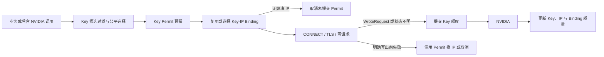

# Key 与代理 IP 联合调度设计

- 日期：2026-08-17
- 状态：待用户审查
- 适用范围：所有发往 NVIDIA 的业务请求、重试、模型发现、Key 健康检查和手工测试
- 部署假设：单实例 `nvida反代` 独占所管理的 NVIDIA Key

## 1. 决策摘要

采用“Key 无突发节拍 + IP 质量带内均衡 + Key-IP 短期粘性绑定”的分层调度：

1. 每个 Key 同时执行 `10 次/滚动 60 秒`硬上限和 `6.2 秒`最小发起间隔。
2. 可用 Key 按最近 60 秒使用次数、当前并发、最长空闲时间和轮询游标依次选择。
3. Key 先进入短暂预留状态，只有请求开始写向 NVIDIA 或无法确定是否写出时才消耗额度。
4. 代理先执行验证、隔离、剩余寿命和绝对年龄硬过滤，再在最高质量分附近的候选中按当前绑定负载均衡。
5. 同一个 Key 默认复用当前 IP，每 30 秒复评；IP 首次发现满 150 秒或剩余寿命不足 30 秒后不再承接新请求。
6. 单次 429/5xx 不直接处罚 IP；只有跨 Key 的同 IP 失败模式和其他 IP 的成功对照同时成立时，才归因为 IP 问题。
7. 不引入完整 `Key x IP` 历史矩阵、随机权重模型、Bandit、Redis 或新的生产依赖。

## 2. 背景与现状

当前 Key Pool 在 `internal/pool/state.go` 中使用每 Key 请求时间切片和 `30 次/60 秒`滚动窗口。它能限制总数，但允许在短时间内连续获取全部额度。启用延迟路由时，Key 还会按延迟 EWMA 加权随机，较快 Key 可能承担更多请求，不满足本次“近期使用次数少者优先”的目标。

当前代理池已经记录验证延迟、真实请求成功率、失败连续数、真实请求首字节 EWMA、首次提取时间和过期时间，并支持失败隔离。但是新绑定时没有最小剩余寿命要求，绝对年龄和当前绑定 Key 数也不参与选择。Manager 通过 Transport 缓存实现约 60 秒的 Key session 粘性，不同超时组合可能为同一 Key 创建多个 Transport，因此 Transport 数不能直接作为绑定数。

现有能力应继续复用：

- Key Pool 的互斥锁、FIFO 等待队列、模型 block、cooldown 和并发限制。
- NVIDIA Client 已有的 `WroteRequest` 检测和仅限写出前的同 Key 代理重放。
- Proxy Pool 的 `QualityScore`、探索采样、隔离、真实请求质量反馈和 `stickyBindings`。
- 相同代理重复采集时保留最早 `FetchedAt`、真实请求历史和隔离状态的合并规则。

## 3. 目标与非目标

### 3.1 目标

1. 任意 Key 不发生分钟开头集中突发，并稳定低于 NVIDIA 的 10 RPM 防护线。
2. 在同等可用条件下，Key 的近期请求数尽量均衡，不因延迟权重长期集中到少数 Key。
3. 初始验证差、已隔离、接近过期或使用年龄过大的代理不得承接新请求。
4. 已证明可靠的代理可以复用连接，但不能被所有 Key 无限制集中绑定。
5. Key 故障、IP 故障和 NVIDIA 全局故障具有可解释且可测试的归因边界。
6. 无 Key 或 IP 可用时提供明确等待或错误，不静默直连 NVIDIA。

### 3.2 非目标

- 不按历史累计请求数永久惩罚代理。
- 不保证持续超过代理物理有效期的流式响应不中断。
- 不在本轮建立多实例共享限频服务。
- 不通过更频繁调用 XApi 增加代理供应；继续遵守每 5 秒提取 2 个的上限。
- 不增加新的管理 API、数据库 migration 或外部调度依赖。

## 4. 必须保持的不变量

```text
同 Key 任意两个已提交请求的间隔 >= 6.2s
同 Key 任意滚动 60s 内已提交请求数 <= 10
同等可用 Key 的最近 60s 请求数差尽量不超过 1
新绑定不会选择剩余寿命 < 30s 或首次发现年龄 >= 150s 的 IP
质量带内 IP 的活跃绑定数差尽量不超过 1
未确认写出 NVIDIA 的代理前置失败不得错误冷却 Key
无法判断请求是否写出时按已经写出处理
```

限频统计的是一次实际 NVIDIA 尝试的开始，不是完成时间。流式请求只在开始时消耗一次 RPM 额度，流持续时间由独立并发上限约束。

## 5. 总体架构



调度保持分层，不计算所有 `Key x IP` 组合分数。Key 层只负责公平、配额和 Key 状态；IP 层只负责生命周期、质量、负载和绑定；Permit 负责两层之间的安全衔接。

## 6. Key 调度

### 6.1 状态

每个 Key 保留：

```text
requestTimes       最近 60 秒内已经提交的时间，最多 10 个
nextAllowedAt      下一次允许提交的时间
reserved           是否有尚未提交或取消的 Permit
busy               非流式占用状态
streamingBusy      当前流式并发数
lastCommittedAt    最近一次提交时间
```

现有 `Enabled`、`AuthInvalid`、模型 block、`CooldownUntil` 和流式并发上限继续保留。

### 6.2 候选过滤

一个 Key 只有同时满足以下条件才能进入候选：

1. 已启用且凭据未失效。
2. 支持当前模型且不在 cooldown。
3. 不在本次请求的 `attempted` 集合中；现有单 Key 恢复规则保持不变。
4. 最近 60 秒已提交请求少于 10 次。
5. `now >= nextAllowedAt`。
6. 没有未决 Permit，并且未达到对应的非流式或流式并发上限。

### 6.3 选择顺序

候选 Key 使用稳定的字典序比较，不再以随机权重主导：

```text
windowCount ASC
activeRequests ASC
lastCommittedAt ASC
roundRobinDistance ASC
```

Key 延迟 EWMA 只能在以上字段完全相同时作为最后平局条件，不能让快 Key 越过近期使用次数更少的 Key。

新加入或刚恢复的 Key 即使 `windowCount=0`，也只能立即获得一个 Permit；提交后必须等待 6.2 秒，因此不会为了追平其他 Key 瞬间消耗 10 次额度。

### 6.4 Permit 生命周期

Permit 只有三个终态：

```text
Reserved -> Committed
Reserved -> Cancelled
Reserved -> CommittedOnAmbiguity
```

流程如下：

1. Key Pool 在互斥锁内过滤、选择并标记 `reserved=true`。
2. Proxy Manager 复用或选择 IP；没有健康 IP时取消 Permit，不消耗 RPM。
3. NVIDIA Client 在 `WroteRequest` 回调触发时提交 Permit。
4. Commit 在 Key Pool 锁内追加 `requestTimes`，设置 `nextAllowedAt=commitAt+6.2s`，并清除 `reserved`。
5. 请求已写出、获得任意 NVIDIA HTTP 状态，或者网络状态无法确定时必须提交。
6. 只有明确发生在目标请求写出前的构造、代理获取、CONNECT、TLS 或拨号失败才允许取消或沿用同一 Permit换 IP。
7. Permit 一旦提交，不因 4xx、5xx、超时、取消、响应体失败或重试结果退款。

现有代理内部最多一次写出前重放沿用同一个未提交 Permit。写出后不得使用同一个 Key 自动重放；切换其他 Key 时必须获取并提交新 Key 自己的 Permit。

### 6.5 节拍与窗口

理论间隔为 `60s / 10 = 6s`，采用 6.2 秒是为了吸收调度时钟和网络到达时间的微小偏差。滚动窗口仍保留为独立硬保护和可观测数据，不能仅依赖一个定时器。

窗口定义为 `(now-60s, now]`。清理窗口后：

```text
paceWait = max(0, nextAllowedAt-now)
windowWait = max(0, oldestRequestAt+60s-now)  // 仅 count == 10 时
retryAfter = max(paceWait, windowWait, cooldownWait)
```

## 7. 等待队列与调用覆盖

当没有立即可用 Key 时，不应直接把所有请求都返回 429：

1. 计算所有适用 Key 的最早恢复时间。
2. 最早恢复时间早于请求 context deadline 和现有 QueueWaitTimeout 时，进入现有 FIFO 队列。
3. Pool 维护一个最早恢复定时器，到期后唤醒队列并重新执行完整过滤，不提前占用未来槽位。
4. 等待请求取消不会留下额度空洞。
5. 无法在请求预算内获得槽位时，返回 429 `nvidia_key_rate_limited`，并给出向上取整的 `Retry-After`。

所有实际访问 NVIDIA 的入口共享这套 Gate：

- Chat、Responses、Embeddings 和 Audio 走普通公平队列。
- 自动健康检查、模型发现和周期验证使用非阻塞的指定 Key 尝试；没有即时槽位时跳过并重新调度，不能挤占正在等待的业务请求。
- 手工 Key 测试使用指定 Key Permit，可以在其请求预算内等待，但不能绕过 6.2 秒节拍。

## 8. 代理生命周期与初始质量

### 8.1 有效寿命

每个代理 generation 使用：

```text
hardExpiresAt = min(providerExpiresAt, firstSeenAt + 180s)
remainingLife = hardExpiresAt - now
age = now - firstSeenAt
```

相同代理每 5 秒重复采集时，可以刷新验证时间、provider 过期时间和探测 EWMA，但不能刷新 `firstSeenAt`、真实请求历史、隔离状态或当前 generation 的 180 秒硬上限。

达到 150 秒后进入 Draining，不再创建新绑定；达到 180 秒后移除该 generation。之后再次采集到同一地址时，必须重新验证并作为新 generation 冷启动，不能直接继承“已证明可靠”状态。永久移除冷却仍优先于新 generation。

### 8.2 新绑定硬过滤

候选 IP 必须同时满足：

```text
成功完成最近一次代理验证
验证延迟不超过有效 MaxLatency，默认 2s
now >= EjectedUntil
remainingLife >= 30s
age < 150s
地址、认证和 generation 均有效
```

硬过滤不能被现有 panic/fallback 模式绕过。没有候选时允许等待下一次采集或返回可重试 503，但不得选择已隔离、验证失败、过老或即将过期的 IP，也不得静默直连。

### 8.3 质量修正

复用现有 `QualityScore` 作为主体。它继续以真实请求成功率、连续失败和 TTFB EWMA 为主，探测延迟只在没有真实请求样本时作为冷启动依据。

在主体质量分上增加轻量生命周期修正：

| 条件 | 修正 |
|---|---:|
| 年龄小于 60 秒 | 0 |
| 年龄 60 至 90 秒 | -5 |
| 年龄 90 至 120 秒 | -10 |
| 年龄 120 至 150 秒 | -20 |
| 剩余寿命 30 至 45 秒 | 额外 -10 |

年龄只能让接近退休的 IP逐步失去新绑定，不能让一个全新的未知 IP 压过已有充分 2xx 证据的稳定 IP。

### 8.4 质量带内负载均衡

新绑定按以下步骤选择：

1. 对硬过滤后的候选计算修正质量分。
2. 找到最高分，将距离最高分不超过 10 分的候选组成质量带。
3. 在质量带内选择 `bindingCount + inflight` 最小的 IP。
4. 依次以修正质量分高、剩余寿命长、真实 TTFB 低和轮询游标打破平局。

`bindingCount` 统计唯一 Key session，不统计 Transport 数。同一 session 因超时组合产生多个 Transport 时仍只算一个绑定。`inflight` 统计当前实际请求，防止长流负载被低估。

### 8.5 冷 IP 探索

真实请求样本少于 3 次的 IP处于 probation：

- 最多绑定一个 Key session。
- 沿用现有每 8 次新选择安排一次探索的节奏。
- 首次纯传输失败立即解绑并隔离；单个 HTTP 429/5xx 只记录证据，不立即隔离。
- 获得 3 个完整 2xx 样本后解除 probation 单绑定限制。

不增加双重探测。代理寿命短，一次硬探测加一个受限真实 canary 比连续两次静态探测更有效。

## 9. Key-IP 粘性绑定

绑定是独立于 Transport 缓存的 canonical session 状态。优先接入并扩展现有 `Pool.stickyBindings`，不新增第二套映射。

```text
Binding {
    session
    proxyKey
    generation
    boundAt
    recheckAt
    retireAt
}
```

绑定规则：

1. Key 有现存绑定且 IP仍通过硬过滤时，优先复用。
2. 每 30 秒到达 `recheckAt` 后重新计算候选，但不强制换 IP。
3. 当前 IP仍在最高质量分 10 分以内时继续绑定，并设置下一次 30 秒复评。
4. 当前 IP被隔离、generation 变化、剩余寿命不足 30 秒、年龄达到 150 秒，或质量落后最佳超过 10 分时立即停止新分配并重绑。
5. 纯传输失败立即删除当前绑定和对应 Transport。
6. 已经提交的长流不迁移、不截断；旧连接进入 Draining，流结束后关闭。

绑定成功不能刷新 `boundAt` 或 IP 的 `firstSeenAt`。否则高频 Key会通过持续成功让一个老 IP 永久占用。

## 10. 故障归因与重试

| 结果 | Key 处理 | IP 与 Binding 处理 |
|---|---|---|
| 2xx 且语义完成 | 消耗额度，清除可恢复失败 | 记录成功和 TTFB，保持绑定 |
| 401 | 消耗额度，标记凭据失效 | 不处罚 IP |
| 403 | 消耗额度，按现有凭据或模型 block 规则处理 | 不处罚 IP |
| 429 | 消耗额度，遵守 `Retry-After` 或 Key 默认 cooldown | 记录 Key-IP 证据，单次不隔离 |
| 500/502/503/504 | 消耗额度，按请求预算决定是否换 Key | 弱记录 IP 证据，不立即隔离 |
| 529 | 消耗额度，触发全局退避 | 不处罚 Key 或 IP |
| 写出前代理传输失败 | 沿用或取消未提交 Permit，不冷却 Key | 强处罚 IP、解绑并关闭 Transport |
| 写出后超时、reset 或 Body 失败 | 消耗额度，不使用同 Key 重放 | 降低 IP 质量并使当前 Transport 失效 |
| 无健康代理 | 取消未提交 Permit | 等待采集或返回可重试 503 |

429/5xx 只有同时满足以下条件才允许隔离 IP：

```text
同一 IP 在 60 秒内被至少 2 个不同 Key 命中同类失败
并且另一个 IP 在同一窗口内服务过真实 2xx
```

同一个 Key 在不同 IP上持续 429 更像 Key 限流；多个 IP同时出现 529 或 5xx 更像 NVIDIA 全局故障。两种情况都不能清空代理池。

## 11. 并发与一致性

1. Key 的候选过滤、Permit 预留、提交和取消继续由 Key Pool 锁保护。
2. IP 的候选过滤、绑定计数、绑定替换和 inflight 变化由 Proxy Pool/Manager 锁保护。
3. 不在网络 I/O 期间持有任一全局锁。
4. 不同时长期持有 Key 与 Proxy 两把锁；流程使用可回滚 Permit 实现逻辑上的联合预留，避免锁顺序死锁。
5. 提交 Permit 前再次检查其仍属于当前请求；重复 Commit、Cancel 或 Release 必须幂等。
6. IP 在选择后、写请求前失效时按写出前代理失败处理；已经写出后不得退款。

## 12. 重启与多实例边界

当前配额状态在内存中。单实例、旧进程完全退出后再启动新进程时：

- 已运行本设计版本的正常重启，对全部已有 Key执行 6.2 秒启动保护即可保持跨进程最小间隔。
- 从当前允许突发 30 次的版本首次升级时，部署流程必须先排空 60 秒，避免旧进程最后一分钟的请求与新规则叠加。
- 不允许两个实例同时使用同一批 Key。若以后需要滚动多实例，必须将 `nextAllowedAt` 和窗口状态放入支持 CAS 的共享存储，或在实例之间静态分区 Key；在有该需求前不引入 Redis。

## 13. 配置与可观测性

第一版将已经确认的业务约束保持为内部常量，避免管理端误配破坏不变量：

```text
keyRequestLimit = 10
keyRequestWindow = 60s
keyPaceInterval = 6.2s
proxyMinRemainingLife = 30s
proxyMaxBindingAge = 150s
proxyHardGenerationAge = 180s
bindingRecheckInterval = 30s
proxyQualityBand = 10
qualityExploreEvery = 8
```

现有代理 `MaxLatency` 设置继续作为运维可调项；未配置时的有效默认值为 2 秒。若国内测试机的真实健康代理 P95 探测延迟高于 1.5 秒，可明确调整为 3 秒并重新验证，不能通过关闭全部慢代理过滤来掩盖问题。

应增加或校正以下非敏感指标：

- Key pace/window/并发导致的等待次数和等待时长。
- 每 Key最近窗口使用次数与下一可用时间，按内部 ID 展示，不暴露 Key。
- IP generation 年龄、剩余寿命、修正质量分、唯一绑定数、inflight 和 probation 状态。
- Permit 的 Commit、明确写出前 Cancel 和模糊状态 Commit 数量。
- 429 的 Key 归因数、IP 对照归因数和 529 全局退避数。

日志和管理响应不得包含 NVIDIA Key、代理密码、XApi URL/query 或 provider 凭据。

## 14. 代码影响边界

实现计划应聚焦以下现有边界：

- `internal/pool/state.go`：10 RPM、6.2 秒节拍、Permit 状态和窗口计算。
- `internal/pool/pool.go`、`queue.go`：公平选择、最早唤醒和指定 Key Gate。
- `internal/router/attempt.go`：Permit 生命周期随一次 Key attempt 传递。
- `internal/upstream/nvidia/client.go`：在已有 `WroteRequest` 信号处提交或取消 Permit。
- `internal/xkproxy/model.go`、`pool.go`：generation 生命周期、修正质量、质量带和 sticky binding 负载。
- `internal/xkproxy/manager.go`：canonical binding、30 秒复评、Draining 和 Transport 失效。
- Key 健康检查、模型发现和手工测试调用方：接入同一个 Gate。

不得借本设计重写协议转换、管理前端、Access Key 鉴权或无关数据库代码。优先扩展现有 `Lease`、`stickyBindings` 和质量反馈接口，不建立只有一个实现的新抽象层。

## 15. 测试设计

### 15.1 Key 单元测试

使用 fake clock 覆盖：

1. 单 Key 同时到达 100 个请求时只有一个进入 Reserved，其余等待。
2. 每推进 6.2 秒最多提交一个请求，任意滚动 60 秒不超过 10 次。
3. 不同窗口使用次数的 Key优先选择次数少者，次数相同时按并发、最长空闲和轮询选择。
4. 新 Key或 cooldown 恢复 Key不能连续追赶式获取额度。
5. 无代理、请求构造失败和明确写出前失败 Cancel 后不留下额度或 reserved 状态。
6. 写出、HTTP 错误和模糊传输状态均 Commit，且不得退款。
7. 队列在最早 Key恢复时唤醒；取消和超时不预占未来槽位。
8. 普通请求、流式请求、重试、健康检查、模型发现和手工测试共享同一窗口。
9. 并发和 race 测试中同一 Key不产生双 Permit 或超过节拍。

### 15.2 代理单元测试

1. 验证失败、探测超过 MaxLatency、隔离中、剩余不足 30 秒和年龄达到 150 秒的 IP不进入新绑定候选。
2. 相同 IP重复采集不刷新 firstSeen、generation、真实质量或隔离状态。
3. 150 秒进入 Draining，180 秒 generation 退役；后续重新采集必须重新验证和 probation。
4. 修正分最高值 10 分范围内按唯一 session 绑定数和 inflight 均衡。
5. 同一 session 的多个 Transport 只计算一个绑定。
6. probation IP最多一个绑定，每 8 次选择获得一次受控探索。
7. 30 秒复评不强制切换仍处于质量带内的 IP。
8. 传输失败立即解绑；老流 Draining 时不被关闭，新请求建立新绑定。

### 15.3 故障归因集成测试

1. 写出前第一个 IP失败，同一 Key和同一 Permit 经第二个 IP成功，仅消耗一次 Key额度。
2. 两个 IP均在写出前失败时不冷却 Key，最终 Permit Cancel。
3. 写出后失败切换 Key时，两个 Key各消耗一次额度。
4. 单 Key单 IP 429 只冷却 Key，不隔离 IP。
5. 两个 Key在同一 IP 429 且另一 IP近期成功时，目标 IP才进入隔离。
6. 529 同时出现时只触发全局退避，不处罚任何 Key或 IP。
7. 无健康代理时不直连，不消耗未提交 Key额度。
8. 持续流跨过 Binding/TTL 边界时进入 Draining，不迁移或重放已提交响应。

### 15.4 性质测试

使用随机请求到达、Key cooldown、IP过期和失败序列进行确定性模拟，持续检查第 4 节全部不变量。测试必须固定随机种子并输出最小失败序列，避免只能通过人工阅读大量 case 判断调度正确性。

## 16. 验收标准

1. Key 调度性质测试证明任意滚动 60 秒最多 10 次且相邻提交至少 6.2 秒。
2. 持续负载下，同等条件 Key 的窗口使用次数差不超过 1；Key 延迟不能造成长期偏斜。
3. 初始慢、失败、隔离、过老和临期 IP在自动化测试中从未承接新请求。
4. 质量带内绑定均衡，已证明可靠 IP优先于未知或失败 IP。
5. 写出前和写出后的重试分别满足 Permit 取消/提交规则，没有额度重复计算或错误退款。
6. Key、IP和全局 NVIDIA 故障归因测试全部通过。
7. 本地相关单元、集成、race、全量 Go 测试和 lint 通过。
8. 国内测试机真实联调确认 XApi 采集、验证、池内轮换、CONNECT、10 RPM 节拍和失败归因；未验证前不得部署生产。

## 17. 发布与回滚约束

首次发布必须在国内环境执行，并按项目部署规则读取服务器目录约束。发布前停止旧实例并完成 60 秒排空，再启动新实例，避免旧的 30 RPM 内存窗口污染新规则。

回滚只回滚应用版本和运行时配置，不删除 Key、代理质量数据或数据库。回滚到旧版本会恢复 30 RPM 突发行为，因此只有在业务不可用且明确接受该风险时执行；不能把回滚描述为仍然满足本设计的 10 RPM 保证。
